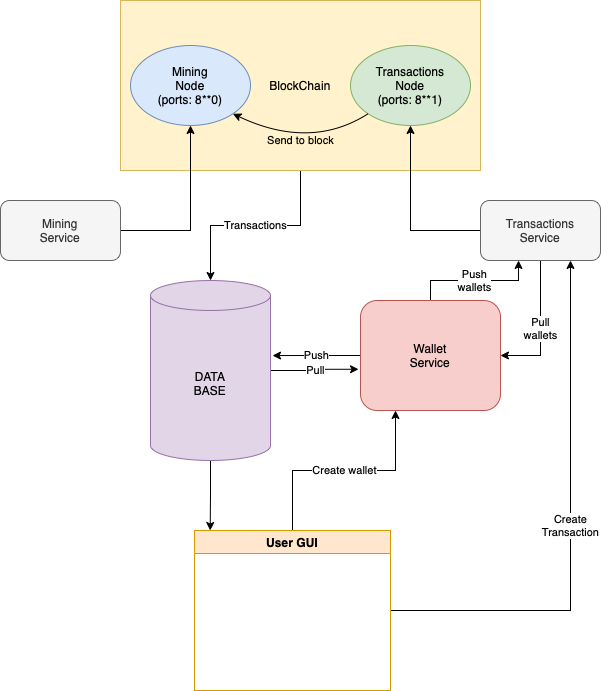

# Architecture


Blockchain contains minimum 2 nodes:
1. Transaction node
2. Mining node

Transaction node recieves transactions from Transactions Service and then send them to mining node.
Each 15 second mining node find new block and put new transactions into mined block.

Transactions Service, Mining Service and Wallet Service are connected to BlockChain.

After new block mined this block send to all available nodes. If mining node unavailable transaction node mines new block itself.
Then mining node sends POST request to Wallet Service to register transactions contained into the new block.
After successful validation Wallet Service makes push with actual changes to DataBase.

# Usage
For the security of the system, it is better to have as many nodes available as possible.

1. Mining nodes must be on ports 8**1.
2. Transaction nodes must be on ports 8**0.
3. Transaction service must be on port 7070.
4. Wallet service must be on port 9090.
5. Mining service better to launch on port 3000.

We always have to register our node after the launch:
```python
req = requests.post('http://127.0.0.1:8000/nodes/register', json={'nodes': ['http://192.168.100.19:8000']})
print(req.status_code)
print(req.json())
```
In nodes we send all available nodes.
```
200
{'message': 'New nodes have been added.', 'total_nodes': ['192.168.100.19:8000']}
```
Then we have to resolve conflicts:
```python
req = requests.get('http://127.0.0.1:8000/nodes/resolve/')
print(req.status_code)
print(req.json())
```
And we'll get that:
```
200
{'chain': [{'index': 1, 'previous_hash': 0, 'proof': 1, 'timestamp': '2022-10-09 22:49:02.169644', 'transactions': 'Genesis Block'}], 'message': 'Our chain is authoritative.'}
```
After successful mining node launching we have to launch transaction node. Look, in json nodes we declare previous and current nodes.
```python
req = requests.post('http://127.0.0.1:8001/nodes/register', json={'nodes': ['http://192.168.100.19:8000', 'http://192.168.100.19:8001']})
print(req.status_code)
print(req.json())

req = requests.get('http://127.0.0.1:8001/nodes/resolve/')
print(req.status_code)
print(req.json())
```
```
200
{'message': 'New nodes have been added.', 'total_nodes': ['192.168.100.19:8001', '192.168.100.19:8000']}
200
{'chain': [{'index': 1, 'previous_hash': 0, 'proof': 1, 'timestamp': '2022-10-09 22:49:03.788793', 'transactions': 'Genesis Block'}], 'message': 'Our chain is authoritative.'}
```
And after launching all transaction nodes, we must notify all nodes about new one.
```python
req = requests.post('http://127.0.0.1:8000/nodes/register', json={'nodes': ['http://192.168.100.19:8000', 'http://192.168.100.19:8001']})
print(req.status_code)
print(req.json())
```

```
200
{'message': 'New nodes have been added.', 'total_nodes': ['192.168.100.19:8000', '192.168.100.19:8001']}
```

Now all nodes are connected.

# Endpoints
## Create wallet [POST]:
```
http://127.0.0.1:9090/new_wallet/
```
JSON must contains phone number.
```python
json={'number': '89057731311'}
```
## Deposit [POST]:
```
http://127.0.0.1:7070/deposit/
```
JSON must contains wallet and amount.
```python
json = 
{
    'wallet': 'jadlen0c1a868d87b6d8cf7223f1e8d1b939e3d832a61aab15d0cddaa9b55e30f33e17', 
    'amount': 100
}
```
## Transaction [POST]
```
http://127.0.0.1:7070/new_transaction/
```
JSON must contains sender, recipient and amount.
```python
json = 
{
    'sender': 'jadlen0c1a868d87b6d8cf7223f1e8d1b939e3d832a61aab15d0cddaa9b55e30f33e17', 
    'recipient': 'jadlen762a33e69f902d887bfb64809d402ed67296876664b3550279e43d35a1ba8358', 
    'amount': 14
}
```
## Chain [GET]
```
http://127.0.0.1:8000/chain/ 

or

http://127.0.0.1:8001/chain/
```

