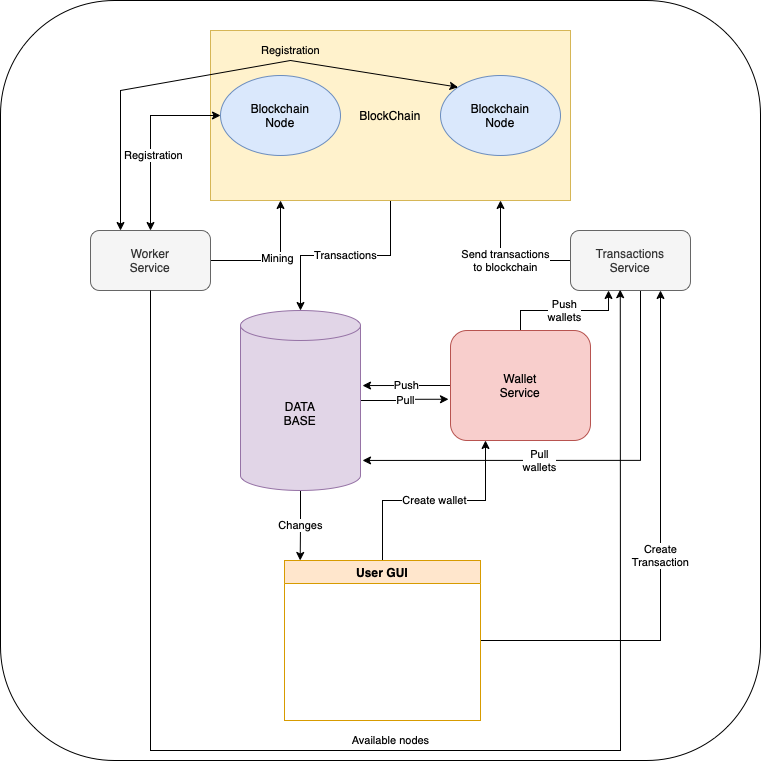

# Architecture


The service consists of the following nodes:
1. Blockchain nodes
2. Transaction node
3. Worker node
4. Wallet node

For the security of the system, it is better to have as many blockchain nodes available as possible.

Transaction node recieves transactions from User and send it at one of available blockchain node.
Blockchain nodes make a connection with Worker, so Worker knows every blockchain node.
As Worker know wach blockchain node, Worker is trying to mine a block in each node every 15 sec.
If a new block has been found, the node that found this block sends information to all other nodes, thereby starting the Consensus algorithm.
New mined block information registering in DB and sends in Wallet.
To avoid double or more spending Transaction Service saves all current deals. Every transaction is validated.
When new block mined Transaction Service overwrite current deals.

DataBased based on Postgres.
If you run blockchain localy you have to first run DB service.
If DB wasn't created before, Wallet Servise's method __fetch_data__ will create DB with table wallets.

# Usage

1. Blockchain nodes must be on ports 8***.
3. Transaction service must be on port 7070.
4. Wallet service must be on port 9090.
5. Mining service better to launch on port 3000.
6. Postgres based DataBase.

## Docker
To run all containers in Docker run this command:
```bash
make dockerup
```
To down the Docker's containers run:
```bash
make dockerdown
```

The Docker will run all necesary containers itself:
1. 3 blockchain nodes
2. 1 transaction service
3. 1 worker service
4. 1 wallet service
5. 1 postgres server

Once docker has started all the containers, all you have to do is run a file called mining_start.py

Thus, you will start mining blocks and will be able to make transactions.

## If you run it localy
[Database]

First of all you have to run postgres service.
Since I developed the service on Mac OS, my Makefile is adapted for OSX operating system.

DBeaver is very helpful tool to work with DB.

[Services]
Start each service on its own port.
Make sure following services are running:
1. Postgres
2. Blockchain node (at least 1 node)
3. Transaction service
4. Worker service
5. Wallet service

Just run each service in different terminals.

# Endpoints
## Create wallet [POST]:
```
http://127.0.0.1:9090/wallet/new_wallet/
```
JSON must contains phone number.
```python
json={'number': '89057731311'}
```
## Deposit [POST]:
```
http://127.0.0.1:7070/transaction/deposit/
```
JSON must contains wallet and amount.
```python
json = 
{
    'wallet': 'jadlen0c1a868d87b6d8cf7223f1e8d1b939e3d832a61aab15d0cddaa9b55e30f33e17', 
    'amount': 100
}
```
## Transaction [POST]
```
http://127.0.0.1:7070/transaction/new_transaction/
```
JSON must contains sender, recipient and amount.
```python
json = 
{
    'sender': 'jadlen0c1a868d87b6d8cf7223f1e8d1b939e3d832a61aab15d0cddaa9b55e30f33e17', 
    'recipient': 'jadlen762a33e69f902d887bfb64809d402ed67296876664b3550279e43d35a1ba8358', 
    'amount': 14
}
```
## Chain [GET]
```
http://127.0.0.1:8000/blockchain/chain/ 

or

http://127.0.0.1:8001/blockchain/chain/
```

# TODO
1. Add certificates support.
2. Auto-backups.